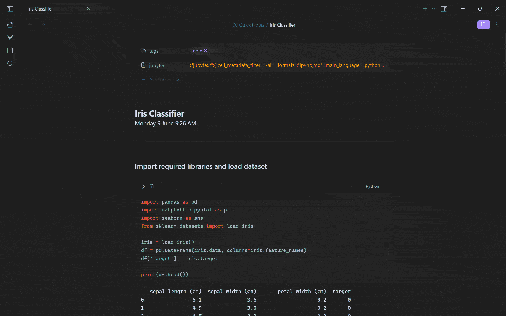
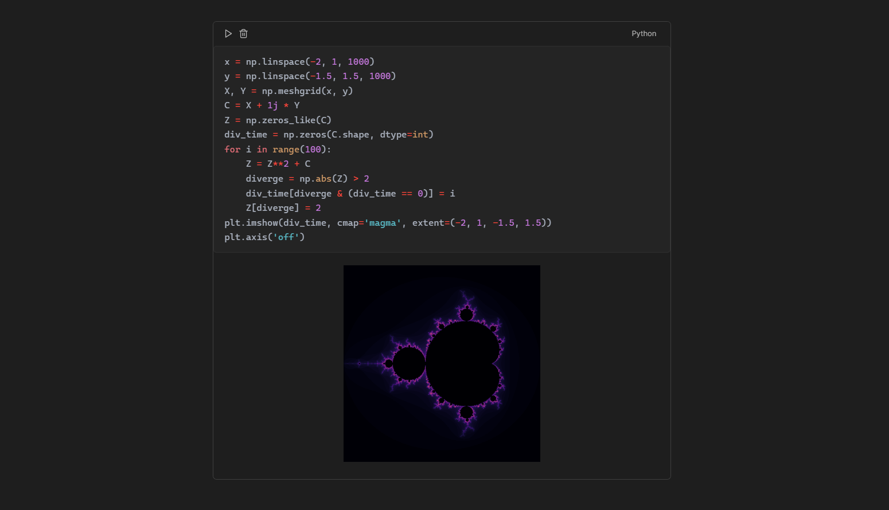

# JupyMD for Obsidian


Enables Jupyter notebook functionality in Obsidian. Make markdown files behave like `.ipynb` notebooks, with live code execution, rich output rendering, and bidirectional syncing between `.md` and `.ipynb` files.

## Integrate your programming notes into Obsidian

With JupyMD you can:

- Run Python code
- Create plots with `matplotlib`
- Conduct data analysis with `pandas` dataframes
- Build machine learning models with `sklearn` and `pytorch`
- And much of what you would typically use a Jupyter notebook for

... all in your Obsidian vault!

## Use-cases:

### Machine learning workflow



### Visualising fractals with `matplotlib`



## Features

- **Notebook Conversion**
    - Convert existing notes in Obsidian to `.ipynb` files via Jupytext
    - Convert existing Jupyter notebooks (`.ipynb`) to Markdown notes (`.md`) via Jupytext
- **Bidirectional Updates** – Changes in Obsidian or Jupyter automatically sync between `.md` and `.ipynb` files
- **Execute Code** – Run code blocks in Obsidian with output captured below each block, regardless of viewing mode
- **Persistent Execution Environment** – Variables and imports defined in one code block are remembered by the following code blocks
- **True Jupyter Sync** – Executed code blocks automatically update output metadata in linked `.ipynb` file
- **Persistent Output Rendering** – Executed code outputs stay visible after restart and sync to `.ipynb` file
- **Rich Output** – Support for `matplotlib` plots and `pandas` dataframe outputs

## Prerequisites

- [Python](https://www.python.org/downloads/)
- [Jupytext](https://github.com/mwouts/jupytext)
- [Matplotlib](https://matplotlib.org/)

Jupytext and Matplotlib can be installed on configured interpreters within the plugin settings.

## Getting started

Download the plugin through the [Obsidian community plugin browser](obsidian://show-plugin?id=jupymd) and enable it.

### Interpreter configuration

It is highly recommended to use a [virtual environment](https://docs.python.org/3/library/venv.html) for an interpreter. It is easy to set up a virtual environment through the interpreter selector within the plugin settings.

JupyMD natively supports [pyenv](https://github.com/pyenv/pyenv) environments and custom interpreters.

To install libraries to a specified interpreter, use the following command line prompt:

```bash
<interpreter> -m pip install <package>
```

You can copy the path to your current interpreter by shift + clicking on the interpreter name on the status bar.

### To convert a note to a Jupyter notebook

Your note will be transformed into a Jupyter notebook when you run a cell through the custom code blocks. This will create an `.ipynb` file with the same file name as the current note on the file directory, and sync its contents automatically to the `.ipynb` file. You may choose to ignore the created `.ipynb` file completely, as its functionality will be mirrored in Obsidian.

To manually convert a note, you may run the following command:

> `JupyMD: Create Jupyter notebook from note`

### To convert a Jupyter notebook to a note

Move your Jupyter notebook to your vault. Executing the following command will list out all `.ipynb` files within your vault which you can select to convert into a note:

> `JupyMD: Create note from Jupyter notebook`

This will create a Markdown note (`.md`) with the same file name as the notebook in the same directory where the Jupyter notebook is.

## Security & Privacy Notice

JupyMD may access directories outside your Obsidian vault to detect available Python interpreters.

This includes:

- System-wide Python installations (e.g. `/usr/bin/python`, `python3`)
- Virtual environments located inside your vault (e.g. `.venv`)
- Optional pyenv-managed Python versions (e.g. `~/.pyenv/versions`)

This access is required to automatically discover and list available Python environments and allow users to select an interpreter for code execution. JupyMD does not transmit any data over the network or modify files outside your vault.

## Contributing

Please read the [contribution guidelines](https://github.com/d-eniz/jupymd/blob/master/CONTRIBUTING.md) if you want to contribute to JupyMD.

This project was originally built to solve a personal problem, and it's still in an early stage. Feedback, feature requests, bug reports, and pull requests are all welcome and appreciated!

JupyMD is an independent project and not affiliated with Project Jupyter, Jupytext, or Obsidian.
